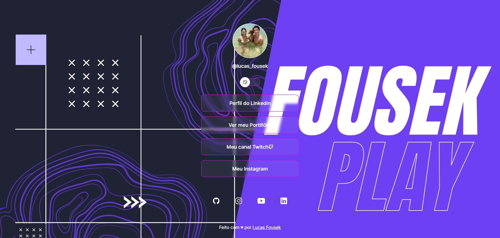
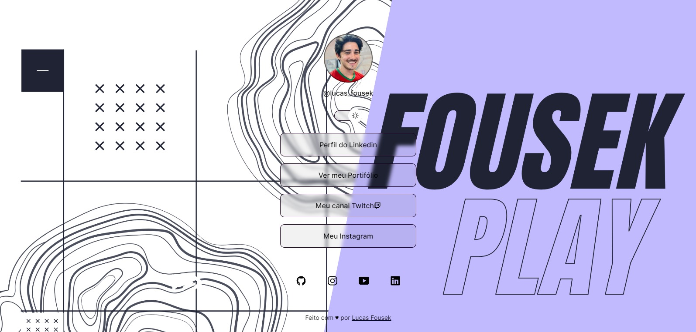
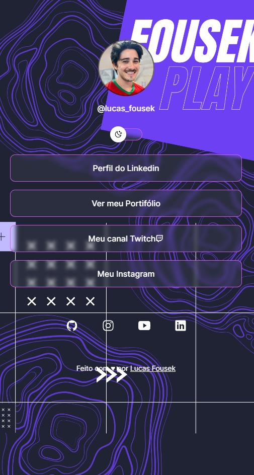
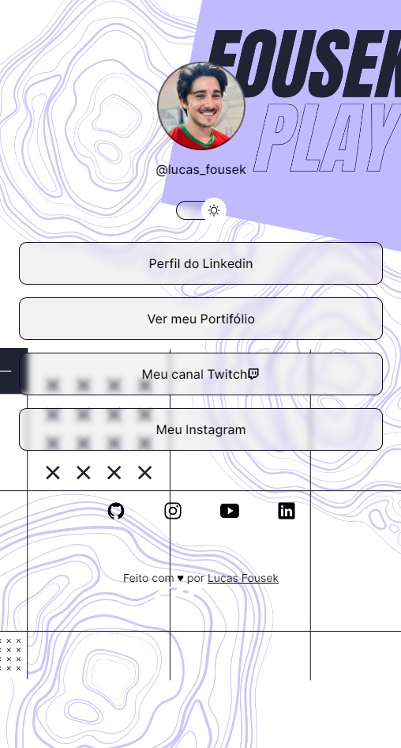

<h1 align="center"> WebLink Social </h1>

Programa exclusivo, promovido pela Rocketseat para ensino de tecnologias WEB.

  <a href="#-tecnologias">Tecnologias</a>&nbsp;&nbsp;&nbsp;|&nbsp;&nbsp;&nbsp;
  <a href="#-projeto">Projeto</a>&nbsp;&nbsp;&nbsp;|&nbsp;&nbsp;&nbsp;
  <a href="#-layout">Layout</a>&nbsp;&nbsp;&nbsp;|&nbsp;&nbsp;&nbsp;
  <a href="#-licença">Licença</a>&nbsp;&nbsp;&nbsp;|&nbsp;&nbsp;&nbsp;

  

 
<h2> 💻Browser WEB Panel </h2>

<h2> 📱Browser Mobile Panel </h2>

## 🚀 Tecnologias

Esse projeto foi desenvolvido com as seguintes tecnologias:

- HTML e CSS
- JavaScript
- Git e Github
- Figma

## 💻 Projeto

O WebLink é um agregador de links para usar como cartão de visitas online.

## 🔖 Layout

Você pode visualizar o layout do projeto através [DESSE LINK](<https://www.figma.com/design/bjfZu58e6aivVUQJXgJjq1/DevLinks-%E2%80%A2-Projeto-Discover-(Community)?m=auto&t=Z2Gwx8S0MQPxZNVM-6>). É necessário ter conta no [Figma](https://figma.com) para acessá-lo.

## : Termo: Licença

Esse projeto está sob a licença MIT.

---

Feito com ♥ por Lucas Fousek
